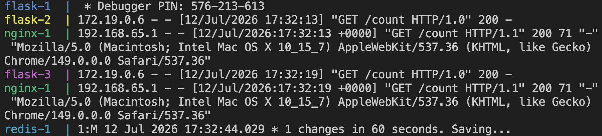

# Flask + Redis: Containerized Multi-Service App


A multi-container app built with Docker Compose — Flask + Redis + nginx,
with persistent storage, service discovery, and horizontal scaling with
load balancing.

**[Docker Hub — flask-redis-app](https://hub.docker.com/r/zishankhokhar/flask-redis-app)** · **[Docker Hub — flask-redis-redis](https://hub.docker.com/r/zishankhokhar/flask-redis-redis)**

---

## Architecture

client → nginx (load balancer) → flask ×N replicas → redis (persistent volume)

| Service | Role |
|---|---|
| `flask` | Stateless web service, scales horizontally |
| `redis` | Key-value store, custom Dockerfile, AOF + RDB persistence |
| `nginx` | Reverse proxy, sole point of ingress |

## Screenshots

<p align="center">
  
  <br/><em>Visit counter served by a Flask replica, backed by Redis</em>
</p>

<br/>

<p align="center">
  
  <br/><em>docker compose up — nginx load-balancing across 3 Flask replicas</em>
</p>

## Quick start

```bash
docker compose up --build
docker compose up --build --scale flask=3   # scale the web tier
```

→ `http://localhost:5002/` · `http://localhost:5002/count`

## Key design decisions

| Problem | Solution |
|---|---|
| Containers can't reach each other via `127.0.0.1` | Service-name DNS via Docker Compose (`REDIS_HOST=redis`) + env vars, no hardcoded IPs |
| Redis data was lost on `docker compose down` | Named volume (`redis_data:/data`) decouples state from container lifecycle |
| Scaling flask broke — replicas can't share a host port | nginx reverse proxy as single ingress point, load-balances across replicas |

## Verify persistence

```bash
docker compose down       # containers removed, volume kept
docker compose up -d
curl http://localhost:5002/count   # continues, doesn't reset
```

## What I'd add next

- Managed/HA Redis (single instance is a state bottleneck)
- Health checks (`depends_on` only controls start order, not readiness)
- CI pipeline to build/push images automatically

---

